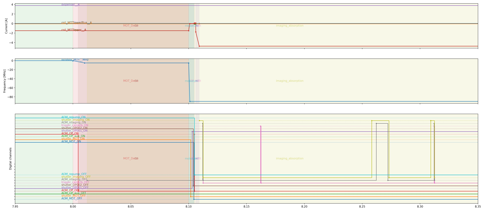

# Wigner_Time
Timeline creation and management for open-loop control in AMO experiments and beyond. Keep scrolling for a quick overview.

## Status
This is currently an alpha release. Usable, but subject to breaking changes. We will release the first stable version soon.


## Optional dependencies (package `extras`) 
 - `performance_and_export` (Recommended): Installs `pyarrow` for memory management, sharing between systems and export to `parquet`.
 - `display`: Installs `matplotlib` and `pyqt` for visualization.
 - `parallel_processing`: Installs `polars` for parallel dataframe manipulation. (WARNING: This is currently not used, but will be in the future)

## Developer Notes
Tests can be run from the root folder with
```bash
poetry run pytest


```

# Getting Started

1.  [Abstract](#orgfb88e4f)
2.  [Why not ADbasic?](#org231a69c)
3.  [Why Wigner Time?](#org5e1d714)
    1.  [Easy (separation of concerns)](#org154d75b)
    2.  [&rsquo;Simple&rsquo;](#org2528e95)
    3.  [Flexible](#org1877e40)
    4.  [Portable](#org99c74fd)
    5.  [Robust](#orgb155d13)
    6.  [Graphical display](#org6bc654b)
4.  [How it works?](#org95dac3d)
5.  [Example (For ADwin systems)](#orge8cea69)
6.  [Future?](#orge0a7f00)
7.  [Status](#org48d7fda)


<a id="orgfb88e4f"></a>

# Abstract

We introduce Wigner Time, an approach and Python package for defining and
manipulating experimental timelines in real-time open-loop control systems.
Fundamentally, procedures are expressed functionally and implemented tabularly, such that the core timelines can be represented with in-memory databases, e.g. `pandas.DataFrame`. The associated functional-style API is clear, flexible, and integrates well with the broader scientific Python ecosystem. The package has been optimized for ADwin-based quantum-optics experiments, but is broadly applicable to any experimental domain requiring precisely timed, multi-device control.




<a id="org231a69c"></a>

# Why not ADbasic?

> **ADbasic** combines the **power and precision** of a low-level programming language with the **intuitive clarity** of a low-level programming languge.


<a id="org5e1d714"></a>

# Why Wigner Time?


<a id="org154d75b"></a>

## Easy (separation of concerns)

So much of physics is choosing the right level of abstraction.

Wigner Time allows you to use a normal and popular programming language to design your experimental timelines, while still utilizing the low-level features of other languages when you really need it.

Don&rsquo;t write ADbasic unless you need to!


<a id="org2528e95"></a>

## &rsquo;Simple&rsquo;

Easy tools often become complicated, but Wigner Time has been carefully designed so that all conveniences are **optional**. You can always drop down a level of abstraction to manually implement a new feature - to the point of just adding CSV tables.


<a id="org1877e40"></a>

## Flexible

By using a functional, data-oriented and bottom-up programming approach to timeline creation, Wigner Time makes it very easy to add and substract changes from the timeline and so can repsond to fast-changing lab requirements.


<a id="org99c74fd"></a>

## Portable

The essential data is always accesible and transferrable to any other language or collaborator

-   even a spreadsheet!


<a id="orgb155d13"></a>

## Robust

Implemented ontop of the \`pandas\` system, the most widely-used data science package.


<a id="org6bc654b"></a>

## Graphical display

Easily generate and investigate your timeline.


<a id="org95dac3d"></a>

# How it works?

Wigner Time is based around the idea of a &rsquo;timeline&rsquo;, which is, at heart, simply a table of rows and columns. The columns detail &rsquo;parameters&rsquo;, e.g. &rsquo;variable&rsquo; (the name of a quantity), &rsquo;time&rsquo;, &rsquo;value&rsquo;, &rsquo;context&rsquo; (a concise description of a real-world situation, e.g. &rsquo;OpticalTrap&rsquo; )

-   Add more parameters by adding columns
-   Add more operations by adding rows

By boiling the design down to a &rsquo;table&rsquo; as the foundation, then we can benfit from decades of database development, particularly in-memory database-like systems like \`pandas\`. Therefore, when in doubt, the user can simply manipulate their timeline using the well-developed \`pandas\` ecosystem. For most operations however, even this won&rsquo;t be necessary as wigner<sub>time</sub> provides layers of conveninece functions ontop of this for designing open-loop experiments.


<a id="orge8cea69"></a>

# Example (For ADwin systems)

You want to digitally control an optical shutter and AOM.

For digital channels, simply *name* the ADwin ports using standard Python lists. These keep track of the physical connections.

``` python
    from wigner_time.adwin import connection as adcon
    from wigner_time import device
    from wigner_time import conversion as conv
    
    connections = adcon.new(
        ["shutter_MOT", 1, 11],
        ["AOM_MOT", 1, 1])
```
For analogue connections, do the same, but specify a linear factor, conversion function or calibration file.

``` python
    devices = device.new(
        ["lockbox_MOT__MHz", 0.05, -200, 200],
        [
            "AOM_MOT__transmission",
            conv.function_from_file(
                "resources/calibration/aom_calibration.dat",
                sep=r"\s+",
            ),
            0.0,
            1.0,
        ],
    )
```
Specify how you want your experiment to begin and end, using readable options and user-specific keywords.

N.B. The use of *pandas.DataFrame* for convenient edits.

``` python
    import timeline as tl
    
    initial = tl.create(
        t=1e-6,
        context="ADwin_LowInit",
    
        shutter_MOT= 1
        AOM_MOT=0,
    )
    final = init
    final['context']="ADwin_Finish"
``` 

And any key processes&#x2026;

``` python
MOT = tl.update(
            shutter_MOT= 0
            AOM_MOT=1,
            context="MOT",
        )
detuned_growth = tl.ramp(
                    lockbox_MOT__MHz=-5,
                    duration=10e-3,
        ),
```
Then combine it all together in readable and modular fashion.

Due to the (hopefully) sensible defaults, each component, e.g. \`ramp\`, will automatically join onto the end of the previous operation in a causal chain.

``` python
tline = tl.stack(
    initial,
    MOT,
    detuned_growth,
    final
)

```


The timeline can then be exported to an ADwin-compatible format.

``` python
    from wigner_time.adwin import core as adwin
    
    adwin.to_data(tline)
```

<a id="orge0a7f00"></a>

# Future?

-   Official support for NI systems
-   Graphical input
-   Feature requests. Post an issue! 
